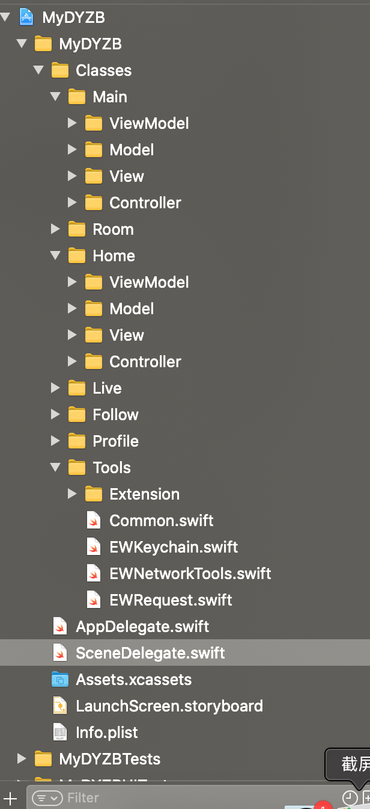

## 仿斗鱼直播

### 项目目录

[斗鱼项目目录mov](./doc/z_video/catalog.mov)



```swift
/*
非iPhoneX：状态栏高度(20.f) + 导航栏高度(44.f) = 64f
iPhoneX系列：状态栏高度(44.f) + 导航栏高度(44.f) = 88f
ios 14
状态栏高度(48.f) + 导航栏高度(44.f) = 92f
*/
// 不调整UIScrollView的内边距 （已经废弃）不需要设置
automaticallyAdjustsScrollViewInsets = false
```

### 状态栏和导航栏

```swift
//获取状态栏的rect
CGRect statusRect = [[UIApplication sharedApplication] statusBarFrame];
//获取导航栏的rect
CGRect navRect = self.navigationController.navigationBar.frame;
//导航栏+状态栏的高度
statusRect.size.height+navRect.size.height
// iOS14

```

```swift
override var prefersStatusBarHidden: Bool {
		return false
}
```

### 项目中使用到的框架

[Alamofire](./doc/Alamofire.md)

[Kingfisher](./doc/Kingfisher.md)

### 项目中使用到的扩展 extension

[UIBarButton+Extension](./MyDYZB/Classes/Tools/Extension/UIBarButton+Extension.swift)

[UIColor+Extension](./MyDYZB/Classes/Tools/Extension/UIColor+Extension.swift)

[NSDate+Extension](./MyDYZB/Classes/Tools/Extension/NSDate+Extension)

[String+Extension](./MyDYZB/Classes/Tools/Extension/String+Extension)

### 定义协议和实现

```swift
// MARK: - 定义协议
protocol PageTitleViewDelegate : class {
    func pageTitleView(_ titleView: PageTitleView, selectedIndex index: Int)
}

class PageTitleView: UIView {
  // MARK: - 自定义属性
  weak var delegate: PageTitleViewDelegate?
}

extension PageTitleView {
  @objc private func titleLabelClick(_ tapGes: UITapGestureRecognizer) {
    // 通知代理
    delegate?.pageTitleView(self, selectedIndex: currentIndex)
  }
}

// MARK: - 对外暴露方法
class PageContentView {
    func setCurrentIndex(_ currentIndex: Int) {
        // 1.是否执行代理方法
        isForbidScrollDelegate = true
        // 2.滚动到指定位置
        let offsetX = CGFloat(currentIndex) * collectionView.frame.width
        collectionView.setContentOffset(CGPoint(x: offsetX, y: 0), animated: false)
    }
}

// MARK: - 遵守PageTitleViewDelegate协议
class HomeViewController : PageTitleViewDelegate {
    func pageTitleView(_ titleView: PageTitleView, selectedIndex index: Int) {
        pageContentView.setCurrentIndex(index)
    }
}

```


### 监听通知

```swift
// 监听通知
NotificationCenter.default.addObserver(
  forName: NSNotification.Name(
    rawValue: DYSwitchRootViewControllerNotification), // 通知名称, 通知中心用来识别通知的
  object: nil,                                           // 发送通知的对象, 为nil 监听任何对象
  queue: nil)                                            // nil 是主线程
{ [weak self](notification) in
 // 切换控制器
 let vc = notification.object != nil ? LiveViewController() : ProfileViewController()
 self?.window?.rootViewController = vc
}

// 注销通知 - 注销指定通知
NotificationCenter.default.removeObserver(
  self,                                                                   // 监听者
  name: NSNotification.Name("DYSwitchRootViewControllerNotification"),    // 监听的通知
  object: nil)                                                            // 发送通知的对象
```

### 设置服务地址和网络监听

```swift
private func initApp() {
  /// 设定baseURL
  let apiURL = URL(string: baseDomain)
  EWNetworkTools.ShareInstance.updateBaseUrl(baseUrl: (apiURL?.absoluteString)!)
  ///注册监听网络状态
  EWNetworkTools.ShareInstance.obtainDataFromLocalWhenNetworkUnconnected()
}
```


