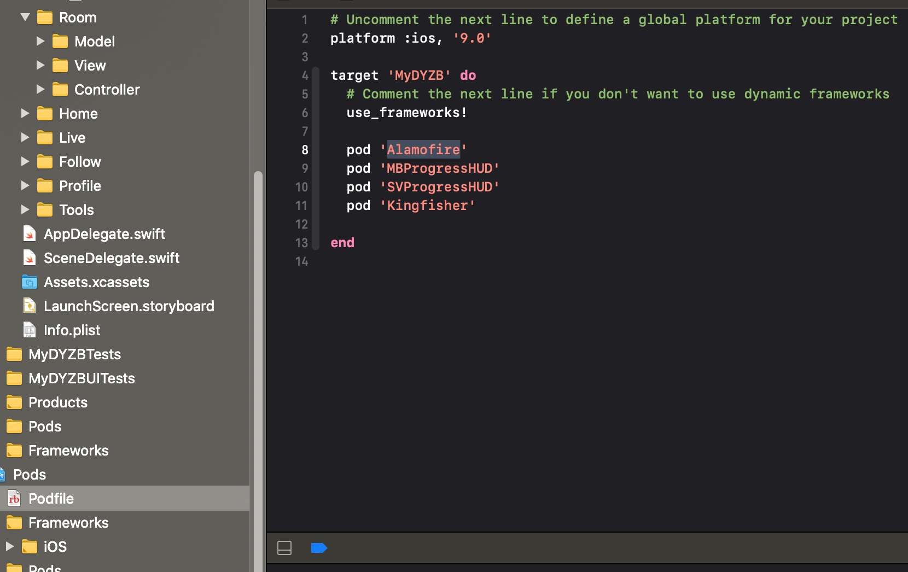

## Alamofire的安装和使用

```shell
gem install cocoapods
```

```shell
# 初始化
pod init
# 安装 第三方版本库
pod install --no-repo-update
```



### Alamofire请求

```swift
private lazy var manager: SessionManager = {
        let config: URLSessionConfiguration = URLSessionConfiguration.default
        let serverTrustPolicies: [String : ServerTrustPolicy] = [
            ///正式环境的证书配置,修改成自己项目的正式url
            "capi.douyucdn.cn": .pinCertificates(
                certificates: ServerTrustPolicy.certificates(),
                validateCertificateChain: true,
                validateHost: true
            ),
            ///测试环境的证书配置,不验证证书,无脑通过
            "capi.douyucdn.cn": .disableEvaluation
        ]
        config.httpAdditionalHeaders = ewHttpHeaders
        config.timeoutIntervalForRequest = ewTimeout
        // 根据config创建manager
        return SessionManager(configuration: config,
                              delegate: SessionDelegate(),
                              serverTrustPolicyManager: ServerTrustPolicyManager(policies: serverTrustPolicies))
    }()
```

```swift
///核心方法
    public func requestWith(url: String,
                            httpMethod: Int32,
                            params: [String : Any]?,
                            success: @escaping EWResponseSuccess,
                            error: @escaping EWResponseFail) {
        if (self.baseUrl() == nil) {
            if URL(string: url) == nil {
                print("URLString无效")
                return
            }
        } else {
            if URL(string: "\(self.baseUrl()!)\(url)") == nil {
                print("URLString无效")
                return
            }
        }
       
        let encodingUrl = encodingURL(path: url)
        let absolute = absoluteUrlWithPath(path: encodingUrl)
        let lastUrl = buildAPIString(path: absolute)
        // 打印header进行调试
        if let params = params {
            print("\(lastUrl)\nheader = \(String(describing: ewHttpHeaders))\nparams = \(params)")
        } else {
            print("\(lastUrl)\nheader = \(String(describing: ewHttpHeaders))")
        }
        //get
        if httpMethod == 0 {
            // 无网络状态获取缓存
            if ewNetworkStatus.rawValue == EWNetworkStatus.notReachable.rawValue
                || ewNetworkStatus.rawValue == EWNetworkStatus.unknown.rawValue {
                let response = self.cacheResponseWithURL(url: lastUrl, paramsters: params)
                
                if response != nil {
                    self.successResponse(responseData: response!, callback: success)
                } else {
                    return
                }
            }
            manageGet(url: lastUrl, params: params, success: success, error: error)
        } else {
            managePost(url: lastUrl, params: params!, success: success, error: error)
        }
    }
```


```swift
import Foundation

extension EWNetworkTools {
    ///get请求
    func getData(path: String,
                 params: [String : Any],
                 success: @escaping EWResponseSuccess,
                 failure: @escaping EWResponseFail) {
        EWNetworkTools.ShareInstance.getWith(url: path, params: params) { (response) in
            // 1.将response转换成字典类型
            guard let json = response as? [String : Any] else {
                failure(NSError(domain: "转字典失败", code: 2000, userInfo: nil))
                return
            }
            /// 2. 保证接口调通，则返回错误信息
            guard json["error"] as? NSNumber == 0 else {
                failure(response)
                return
            }
            // 3.获取数组
            guard let dataArray = json["data"] as? [[String : Any]] else {
                failure(NSError(domain: "获取数组失败", code: 2000, userInfo: nil))
                return
            }
            /// 4.成功
            success(dataArray as AnyObject)
        } error: { (error) in
            failure(error)
        }
    }
    ///post请求
    func postData(path: String,
                  params: [String : Any],
                  success: @escaping EWResponseSuccess,
                  failure: @escaping EWResponseFail) {
        EWNetworkTools.ShareInstance.postWith(url: path, params: params) { (response) in
            guard let json = response as? [String : Any] else { return }
            guard json["status"] as? NSNumber == 1 else {
                print(json["msg"] as? String ?? "")
                failure(response)
                return
            }
            success(response as AnyObject)
        } error: { (error) in
            failure(error)
        }
    }
    
}
```

